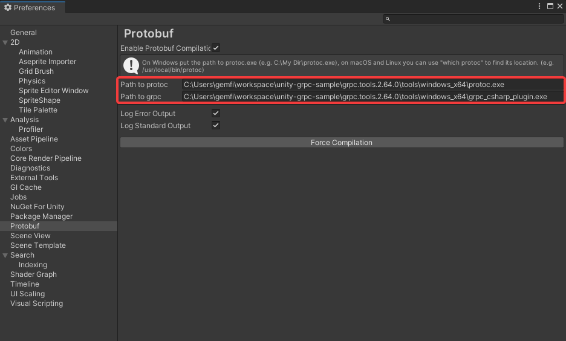

# unity-grpc-sample
This is a sample project for gRPC communication using [YetAnotherHttpHandler](https://github.com/Cysharp/YetAnotherHttpHandler) and [protobuf-unity](https://github.com/5argon/protobuf-unity).

## Unity Version
The Unity version used is 2022.3.21f1.

## protobuf-unity Configuration Required
Fill in the full paths of the following two files included in the project in Edit -> Preferences -> Protobuf -> Path to protoc, Path to grpc:
- unity-grpc-sample\grpc.tools.2.64.0\tools\windows_x64\protoc.exe
- unity-grpc-sample\grpc.tools.2.64.0\tools\windows_x64\grpc_csharp_plugin.exe  

## Sample Scene Path
- Assets/UnityGrpcSample/Scenes/SampleScene.unity 
    Press the Play button while a gRPC server, which has registered the same proto file as [`greet.proto`](https://github.com/gemfile0/unity-grpc-sample/blob/main/Assets/UnityGrpcSample/protos/greet.proto), is running. The server response will be displayed on ResponseText(TextMeshProUGUI).

## Sample gRPC Server Used
- https://learn.microsoft.com/ko-kr/aspnet/core/tutorials/grpc/grpc-start?view=aspnetcore-8.0&tabs=visual-studio
- Or use another implementation from https://grpc.io/docs/languages/

## Package Dependencies
- [YetAnotherHttpHandler](https://github.com/Cysharp/YetAnotherHttpHandler)
    - [NuGetForUnity](https://github.com/GlitchEnzo/NuGetForUnity)
        - System.IO.Pipelines
        - System.Runtime.CompilerServices.Unsafe
        - Grpc.Net.Client

- [protobuf-unity](https://github.com/5argon/protobuf-unity)
    - [NuGetForUnity](https://github.com/GlitchEnzo/NuGetForUnity)
        - Google.Protobuf 
    - [Grpc.Tools](https://www.nuget.org/packages/Grpc.Tools/)

    